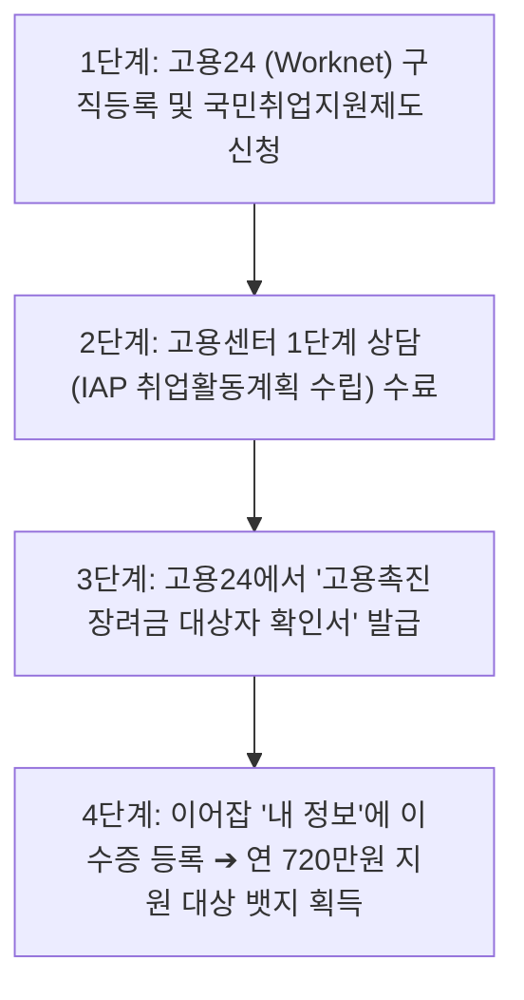

# 📋 이어잡(EOJOB) 고용촉진제도 혜택 기획 및 서비스 반영안

---

## 1. 💡 고용촉진제도(고용촉진장려금) 혜택의 실체 정의

### (1) 제도 개요
**고용촉진장려금**은 고용노동부에서 주관하는 대표적인 고용지원금 제도로, 취업에 어려움을 겪는 **취약계층(중장년/시니어, 국민취업지원제도 이수자 등)**을 채용한 사업주에게 인건비의 일부를 국가가 지원하여 구직자의 취업을 촉진하고 기업의 인건비 부담을 경감해주는 제도입니다.

---

### (2) 실제 지원 혜택 금액 및 지원 조건 (기업 기준)

| 구분 | 우선지원대상기업 (중소·중견기업) | 대규모 기업 | 지급 주기 및 기간 |
| :--- | :--- | :--- | :--- |
| **일반 대상자 (중장년/시니어 이수자 등)** | **월 60만원 (연 720만원)** | 월 30만원 (연 360만원) | 3개월 단위 지급 (총 1년, 4회) |
| **특수 대상자 (중증장애인·여성가장 등)** | **월 80만원 (연 960만원)** | 월 40만원 (연 480만원) | 3개월 단위 지급 (최대 2년) |

#### 📌 기업 필수 수급 조건
1. **고용보험 가입 사업장** (우선지원대상기업/중소기업 중심).
2. **근로 조건**:
   - 근로계약 기간의 정함이 없거나(정규직), 최소 1년 이상의 근로계약 체결.
   - 최저임금 이상 지급 및 4대 보험(고용/산재/국민/건강) 가입 필수.
3. **인원 감원 제한**:
   - 채용 전 3개월부터 채용 후 1년까지 권고사직 등 **사업주에 의한 인원 감원(인위적 감원)이 없어야 함**.

---

## 2. 🏢 기업이 혜택(지원 대상 자격)을 확인하는 방법

기업이 시니어 구직자 채용 시 해당 구직자가 고용촉진장려금 지원 대상인지 확인하는 방법은 크게 **[정부 공식 시스템 확인]**과 **[이어잡 플랫폼 내부 자동 확인]** 2가지로 나뉩니다.

---

### (1) 정부 공식 시스템 확인 절차 (고용24)
1. **증명서 확인**: 구직자가 발급받은 **`[고용촉진장려금 지원 대상자 확인서]`** 또는 **`[취업지원프로그램 이수증]`** 제출 요청.
2. **고용24 (www.work24.go.kr) 사전 조회**:
   - 기업 회원 로그인 ➔ `기업지원금` ➔ `고용촉진장려금` ➔ `대상자 조회`.
   - 구직자의 **성명 및 주민등록번호** 입력 시 지원 대상 여부 및 남은 지원 기간 즉시 확인 가능.

---

### (2) 이어잡(EOJOB) 서비스 내 기업 확인 기능 기획 (UI/UX)
기업이 시니어 프로필을 열람할 때 혜택을 한눈에 파악할 수 있도록 서비스에 반영합니다.

1. **`[고용촉진 혜택 대상자]` 직관적 뱃지 표시**:
   - 시니어 프로필 카드 상단에 **`[연 720만원 정부 지원 대상]`** 뱃지 표출.
2. **기업 맞춤 지원금 계산기 (Benefit Calculator)**:
   - "이 시니어 인재 채용 시 **월 60만원 / 1년 총 720만원**의 고용촉진장려금을 신청할 수 있습니다." 팝업 안내.
3. **이수 증명서 미리보기 (Verified Badge)**:
   - 시니어가 마이페이지에 등록한 국민취업지원제도 이수증/확인서 캡처본을 기업 담당자가 바로 확인 가능.

---

## 3. 🎓 혜택을 받으려면 구직자(시니어)가 수료해야 하는 내용

고용촉진장려금은 단순 구직자에게 지급되지 않으며, **고용노동부 장관이 지정한 취업지원프로그램을 수료하고 고용24(워크넷)에 구직등록**이 되어 있어야 대상자가 됩니다.

---

### (1) 구직자 필수 이수 취업지원프로그램 종류

| 프로그램 명칭 | 대상 및 세부 요건 | 이수 완료 기준 (고용촉진 자격 부여) |
| :--- | :--- | :--- |
| **1. 국민취업지원제도 (1유형 / 2유형)** | 만 15세~69세 구직자 (중장년 시니어 핵심 참여) | **1단계(취업활동계획 IAP 수립) 완료시 자격 즉시 취득** |
| **2. 직업능력개발훈련 (국민내일배움카드)** | 고용노동부 인정 직업훈련 과정 참여자 | **3개월 이상 훈련과정 이수(수료)** |
| **3. 지자체 및 고용센터 취업지원 프로그램** | 성취프로그램, 취업희망프로그램, 중장년 재취업 과정 등 | 지정 프로그램(보통 1~2주) 전 과정 이수 |

---

### (2) 시니어 구직자 4단계 이수 & 등록 가이드 (이어잡 안내 절차)

1. **1단계**: 고용24(www.work24.go.kr) 회원가입 및 구직신청 등록.
2. **2단계**: 관할 고용센터 방문 또는 온라인 신청으로 **국민취업지원제도** 참여 ➔ 1단계 상담 및 IAP 수립 완료.
3. **3단계**: 고용24 마이페이지 ➔ `[고용촉진장려금 대상자 확인서]` 발급 (PDF/이미지 저장).
4. **4단계**: 이어잡(EOJOB) 로그인 ➔ `[내 정보]` ➔ `[고용촉진장려금 대상자 인증]` 버튼 클릭 후 확인서 업로드 ➔ 프로필에 지원 대상 뱃지 활성화.

---

## 4. 🚀 이어잡(EOJOB) 서비스 구현 및 UX/UI 연계 방안

### (1) 구직자(Senior) 측 화면 기획
- **`BasicProfilePage.tsx` / `SeniorProfilePage`**:
  - "정부 고용촉진장려금(연 최대 720만원) 대상자이신가요?" 안내 카드 추가.
  - 국민취업지원제도 이수 여부 체크박스 및 이수증 파일/발급번호 입력 폼 구성.

### (2) 기업(Company) 측 화면 기획
- **`JobDatabasePage.tsx` (프로젝트 탐색)** & **`ProjectDetailPage.tsx`**:
  - 시니어 인재 카드 우측 상단에 **`[연 720만원 지원 뱃지]`** 노출.
  - 카드 클릭 시 "채용 시 기업 인건비 절감 효과: 1년 간 총 720만원 (분기별 180만원 환급)" 실시간 계산 레이어 표출.

---

## 5. 📑 한눈에 보는 요약 보고서

1. **혜택 실체**: 중소·중견기업이 국민취업지원제도 등을 수료한 시니어를 채용할 경우, **1년간 총 720만원 (월 60만원 x 12개월)**의 인건비를 국가로부터 지원받음.
2. **기업 확인 방법**: 고용24(www.work24.go.kr)에서 구직자 이름/주민번호로 사전 조회하거나, 이어잡 프로필의 `[고용촉진 지원 대상 뱃지]` 및 이수증으로 즉시 확인.
3. **구직자 수료 내용**: 고용24 구직등록 후 **국민취업지원제도 1단계(IAP) 수료** 또는 **국민내일배움카드 3개월 이상 훈련과정 수료** 필요.
