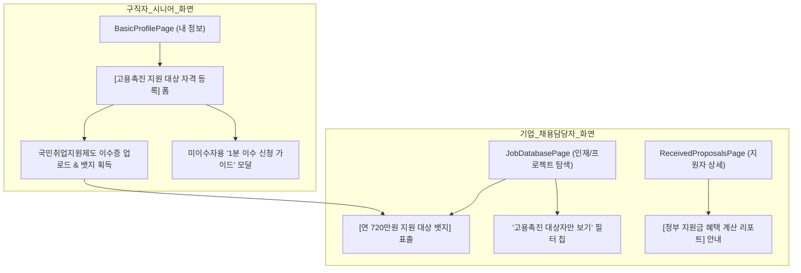

# 🚀 이어잡(EOJOB) 고용촉진제도 서비스 적용 및 UI/UX 구현 상세 기획안

---

## 🎯 1. 기획 목적 & 서비스 핵심 가치 (Value Proposition)

### 💡 "시니어에게는 서류 합격률 2배 상승, 기업에게는 연 720만원 인건비 절감 효과"
이어잡에 고용촉진제도를 접목함으로써 플랫폼의 양대 사용자(시니어 구직자 vs 기업 채용담당자) 모두에게 압도적인 가치를 제공합니다.

* **기업(Company)**: 단순 채용을 넘어 **"시니어 인재의 실무 역량 + 연 720만원(월 60만원) 정부 지원금 혜택"**을 동시에 얻어 인건비 부담 획기적 경감.
* **시니어(Senior)**: 국민취업지원제도 이수 인증 뱃지를 획득함으로써 **기업 채용 우대 확률을 극대화**하고, 미이수자에게는 이수 가이드를 제공하여 국가 제도 혜택 연결.

---

## 📱 2. 사용자 역할별 화면/기능 적용 방안



---

### (1) 👴 시니어(Senior) 사용자 서비스 적용 방안

#### ① `BasicProfilePage.tsx` (내 정보 입력/수정 화면)
- **[고용촉진 지원 대상 자격 인증 섹션] 추가**:
  - `[토글]` "고용노동부 고용촉진장려금(연 720만원) 지원 대상자이신가요?"
  - `[선택]` 수료한 취업지원프로그램 선택:
    - 🟢 국민취업지원제도 (1유형 / 2유형 1단계 IAP 수립 완료)
    - 🔵 국민내일배움카드 (3개월 이상 직업능력개발 훈련 수료)
    - 🟡 지자체/고용센터 취업지원 프로그램 이수
  - `[파일 첨부]` `[고용촉진장려금 대상자 확인서 / 이수증]` PDF 또는 캡처 이미지 등록.
  - `[안내 헬프 카드]` **"아직 수료하지 않으셨나요?"**:
    - "국민취업지원제도 1단계(약 2주 소요)를 완료하면 기업에서 연 720만원 지원금을 받을 수 있어 **채용 합격률이 2배 이상 상승**합니다!"
    - `[1분 만에 신청방법 보기 ➔]` 가이드 팝업 버튼 제공.

#### ② `SeniorProfilePage` (마이프로필 보기 화면)
- 상단 인재 정보 카드에 **`[✓ 고용촉진 지원 대상 인증 완료]`** 인프라 뱃지 노출.
- "기업 채용 우대 지수 95점 / 정부 지원금 혜택 준비됨" 상태 표출.

---

### (2) 🏢 기업(Company) 사용자 서비스 적용 방안

#### ① `JobDatabasePage.tsx` (프로젝트 & 인재 탐색 화면)
- **필터바(Filter Bar) 칩 추가**:
  - `[전체]` `[IT/디자인]` `[경영/기획]` `[🔥 고용촉진장려금 대상자만 (연 720만원 지원)]` 칩 필터 제공.
- **인재/프로젝트 카드 노출**:
  - 카드 우측 상단 강조 뱃지: **`[연 720만원 정부 지원 대상 인재]`** (에메랄드/주황 강조 컬러).
  - 카드 서브타이틀: "채용 시 기업 인건비 월 60만원 지원 혜택 제공 인재".

#### ② `ReceivedProposalsPage.tsx` / `ProjectDetailPage.tsx` (지원자 및 인재 상세 팝업)
- **[정부 지원 혜택 실시간 리포트 Card]** 삽입:
  ```text
  ┌─────────────────────────────────────────────────────────────┐
  │ 💰 이 인재 채용 시 기대되는 정부 지원금 혜택                  │
  │ • 고용촉진장려금: 연 720만원 (월 60만원 x 12개월 환급)        │
  │ • 고용보험 적용 및 우선지원대상기업 기준 충족 시 신청 가능      │
  │ [📄 제출된 취업지원프로그램 이수증 확인하기] [고용24 조회 가이드] │
  └─────────────────────────────────────────────────────────────┘
  ```
- **[서류 미리보기]**: 시니어가 첨부한 고용촉진 확인서 팝업 미리보기 기능.

#### ③ `CompanyHomePage` (기업 대시보드)
- **"우리 기업 예상 인건비 절감액"** 메트릭 카드 표출:
  - `[현재 검토 중인 고용촉진 대상 인재: 3명 ➔ 채용 시 최대 2,160만원 인건비 지원 혜택 가능]`

---

### (3) 🌐 랜딩 페이지 (`LandingPage.tsx`) 반영 방안

- **Hero 섹션 & 기업 혜택 하이라이트 카러셀**:
  - "경력 있는 시니어를 채용하고, **정부 고용촉진장려금 연 720만원** 혜택까지 받아보세요!"
  - 단순 인력 매칭 플랫폼과의 차별화 요소로 강조.

---

## 🛠️ 3. 기술 구현 개발 로드맵 (Technical Implementation Plan)

### 1단계: 데이터 모델 확장 (`profileService.ts`)
```typescript
export type SeniorProfileData = {
  // 기존 필드...
  employmentSubsidyTarget?: boolean; // 고용촉진장려금 대상 여부
  employmentSubsidyProgram?: '국민취업지원제도' | '국민내일배움카드' | '지자체프로그램' | '기타';
  employmentSubsidyDocName?: string; // 이수 증명서 파일명
  employmentSubsidyDocUrl?: string; // 이수 증명서 다운로드 URL
};
```

### 2단계: UI 컴포넌트 개발 및 반영
1. `src/app/BasicProfilePage.tsx`: 고용촉진 지원 대상 인증 폼 및 확인서 업로드 UX 구축.
2. `src/app/JobDatabasePage.tsx`: 고용촉진 대상자 필터 칩 & 카드 뱃지 반영.
3. `src/app/wireframe/FlowPages.tsx`: 지원자 상세 리포트 카드 & 시니어 프로필 인증 뱃지 추가.
4. `src/app/LandingPage.tsx`: 기업 혜택 강조 섹션 텍스트 및 그래픽 배치.

---

## 📊 4. 적용 기대 효과 Summary

| 구분 | 시니어 구직자 측 효과 | 기업 채용담당자 측 효과 | 이어잡 플랫폼 측 효과 |
| :--- | :--- | :--- | :--- |
| **핵심 효과** | • 이수자: 채용 서류 합격률 급증<br>• 미이수자: 국취제 1단계 참여 동기부여 | • 채용 1건당 연 720만원 인건비 절감<br>• 지원금 서류 수고 없는 직관적 확인 | • 타 플랫폼 대비 압도적 B2B 수주 경쟁력 확보<br>• 고용노동부 친화적 ESG 브랜드 구축 |
