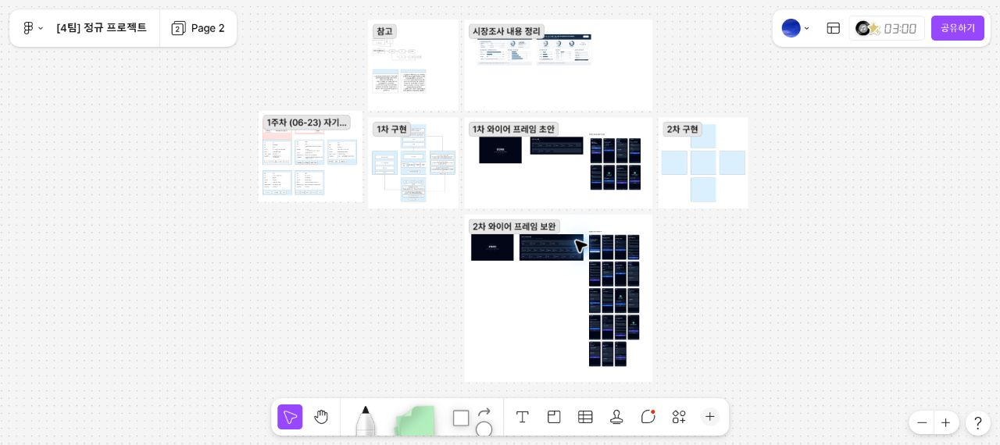

# FigJam 디자인 참고자료

## 원본

- 파일: `[4팀] 정규 프로젝트`
- 페이지: `Page 2`
- 지정 노드: `1204:888`
- 원본 링크: https://www.figma.com/board/TkWUM9dyQ2i6w6fjrkWm25/-4%ED%8C%80--%EC%A0%95%EA%B7%9C-%ED%94%84%EB%A1%9C%EC%A0%9D%ED%8A%B8?node-id=1204-888&p=f&t=SyiNLxAjvHhpBCQf-0

## 로컬 참고 이미지

이 이미지는 2026-08-05 기준 Page 2의 전체 배치를 로컬 프로젝트에 보관한 참고용 스냅샷입니다.
와이어프레임의 최신 내용과 댓글은 항상 원본 FigJam을 기준으로 확인합니다.

## 확인된 영역

- 시장조사 내용 정리
- 1주차 작업
- 1차 구현
- 1차 와이어프레임 초안
- 2차 구현
- 2차 와이어프레임 보완

팀원은 자신의 담당 영역을 수정하기 전에 원본 FigJam과 이 참고 이미지를 함께 확인합니다.
