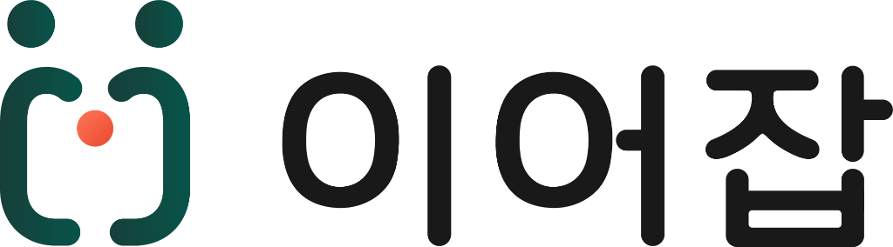
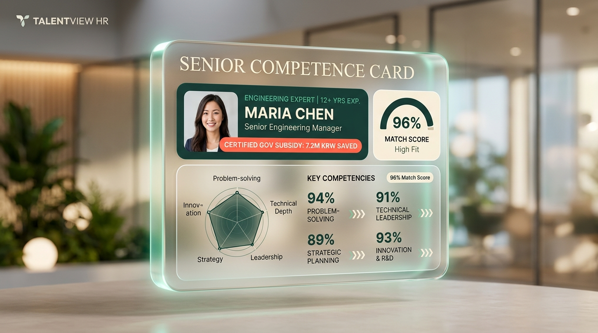

  

    FOR HR LEADERS & RECRUITERS
  

  

    
  

  <h1 class="text-4xl font-black tracking-tight text-white mb-3">
    검증된 시니어 전문가 채용, 
    정부 지원금으로 연 720만원 절감하세요
  </h1>
  

    AI 역량 분석을 통한 사전 검증 & 고용노동부 장려금 원스톱 연계 플랫폼
  

  

    제조 · IT · 경영기획 · 공정품질 · R&D 정부과제 시니어 자문단 풀 보유
  

<!--
기업 인사담당자님을 위한 이어잡 서비스 소개 발표입니다.
높은 인건비와 역량 검증의 한계로 고민하셨던 시니어 채용을 AI와 정부 지원금으로 명쾌하게 해결해 드립니다.
-->

---
layout: two-cols
---

# 🚨 인사담당자의 3대 채용 고민

검증된 전문 인력은 절실하지만, 채용 리스크와 고정 인건비는 큰 부담입니다.

::left::

  

    
1. 높은 고정 인건비 부담

    
10~20년차 전문가는 억대 연봉과 4대보험 부담으로 정규직 채용 망설임

  

  
  

    
2. 이력서 검토 및 역량 검증 한계

    
단순 직급/회사명만으로는 우리 회사의 당면 과제 해결 여부 판단 불가

  

  

    
3. 복잡한 정부 지원금 제도의 벽

    
고용촉진장려금 등 정부 제도는 알고 있으나 대상자 판별과 서류 행정의 번거로움

  

::right::

  

    
    

      💡 "실제 프로젝트 해결 역량만 쏙쏙 뽑아주는 파트너가 필요합니다"
    

  

---
layout: default
---

# 💡 이어잡(EOJOB)이 제공하는 3대 핵심 해결책

  

    
🎯

    
PRE-SCREENING

    <h3 class="text-lg font-black text-[#173F3A] mb-2">AI 경험 카드 검증</h3>
    

      음성 심층 인터뷰를 통해 <b>"불량률 80% 감축", "정부 R&D 수주"</b> 등 수치화된 실제 문제 해결 역량을 사전에 완벽히 요약 제공합니다.
    

  

  

    
💰

    
GOV SUBSIDY

    <h3 class="text-lg font-black text-[#F06B4F] mb-2">연 720만원 지원금 연계</h3>
    

      국민취업지원제도 이수 인증 인재 채용 시 <b>월 60만원씩 연간 720만원</b> 고용노동부 환급 리포트를 실시간 확인하고 연계합니다.
    

  

  

    
⏱️

    
FLEX WORK

    <h3 class="text-lg font-black text-[#173F3A] mb-2">초유연 고용 계약 모델</h3>
    

      정규직 외에도 <b>주 2~3일 반일제, 시간제, 단기 프로젝트 자문</b> 등 기업 상황에 맞춘 유연한 고용 형태를 지원합니다.
    

  

---
layout: two-cols
---

# 📱 AI 경험 카드 : 검토 시간 80% 단축

이력서 10장 읽을 시간에, 핵심 역량 카드로 30초 만에 파악

::left::

  

    
  

::right::

  

    

      📊 3차원 적합도 점수(0~100점)
      
우리 회사의 등록 프로젝트 요건과 인재의 경험 데이터를 교차 분석하여 정밀 매칭 스코어 제공

    

    

      🎖️ 정부 지원금 인증 뱃지
      
국민취업지원제도 이수 확인서가 사전 검증된 인재에게 공식 인증 마크 표출

    

    

      🎯 문제 해결 중심 성과 요약
      
추상적인 자기소개가 아닌 실제 완수 과제와 기술 스택만 일목요연하게 구조화

    

  

---
layout: default
---

# 💰 고용촉진장려금 채용 인원별 절감 시뮬레이션

우선지원대상기업(중소·중견기업) 기준 **채용 1인당 월 60만원 (연 720만원)** 환급

| 채용 인원 | 분기별 지원금 환급액 | 연간 인건비 지원금 총액 | 기업 실부담 인건비 경감 효과 |
| :---: | :---: | :---: | :---: |
| **1명** | **180 만원** | **720 만원** | 신입 1인 인건비의 약 25% 절감 |
| **2명** | **360 만원** | **1,440 만원** | 연간 1,440만원 순 현금 환급 |
| **3명** | **540 만원** | **2,160 만원** | 전문 시니어 자문단 구축 비용 대폭 절감 |
| **5명** | **900 만원** | **3,600 만원** | 중소기업 1개 부서 인건비의 30% 이상 정부 보전 |

  

    <b>📌 기업 신청 요건</b>: 고용보험 가입 및 1년 이상 근로계약 체결 시 고용24를 통해 분기별 자동 신청 가능
  

  

    이어잡에서 신청 서류 원스톱 가이드 제공!
  

---
layout: default
---

# 🤝 인사담당자를 위한 원스톱 채용 프로세스

  

    
1

    
과제/직무 등록

    

      회사에서 해결하고 싶은 실무 프로젝트나 채용 포지션 조건을 간단히 등록합니다.
    

  

  

    
2

    
AI 맞춤 인재 추천

    

      적합도 90점 이상의 인재와 <b>[연 720만원 지원 대상]</b> 인재의 경험 카드를 전달받습니다.
    

  

  

    
3

    
사전 면담 & 계약

    

      온/오프라인 가벼운 미팅 후 정규직 또는 유연 프로젝트 계약을 체결합니다.
    

  

  

    
4

    
지원금 수령 가이드

    

      고용노동부 고용24를 통한 분기별 180만원 환급 절차를 플랫폼에서 밀착 안내합니다.
    

  

---
layout: center
class: text-center
---

  
  
  <h2 class="text-2xl font-black text-[#173F3A] mb-3">
    지금 우리 회사에 꼭 필요한 
    검증된 시니어 인재를 무료로 추천받으세요
  </h2>

  

    담당 포지션이나 당면 과제를 메일로 회신해 주시면, 
    <b>최적 적합도 인재 3인의 경험 카드와 지원금 계산 리포트</b>를 무상 제공해 드립니다.
  

  

    

      
🌐 서비스 둘러보기

      
https://eojob.kr

    

    

      
✉️ 채용 및 제휴 문의

      
contact@eojob.kr

    

  

